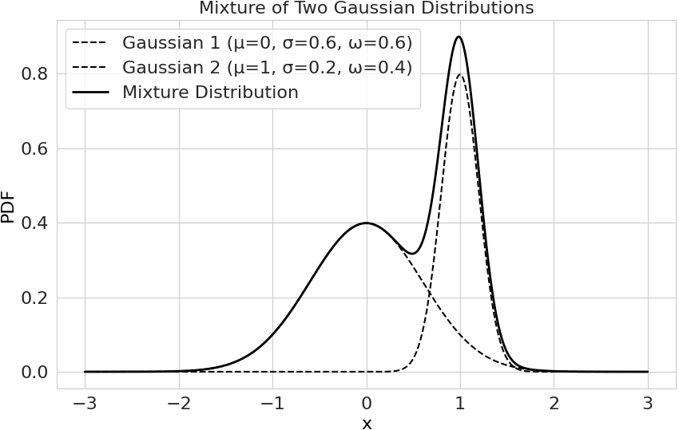
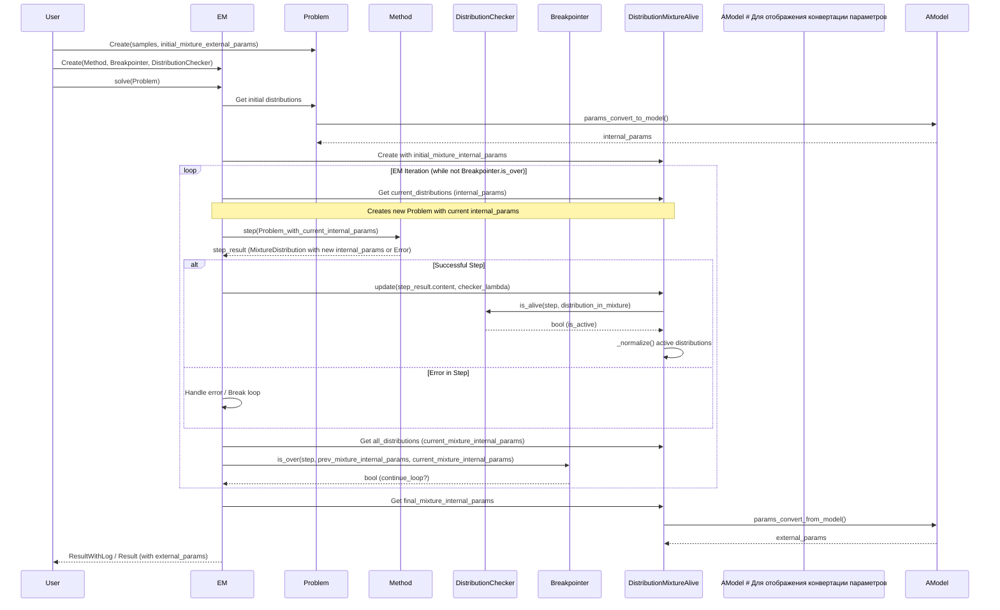
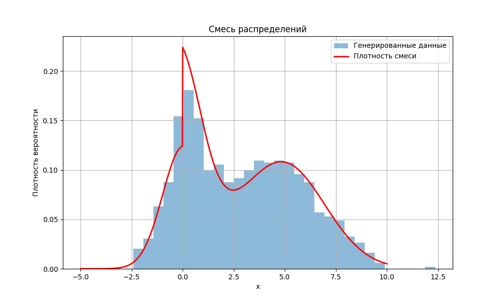
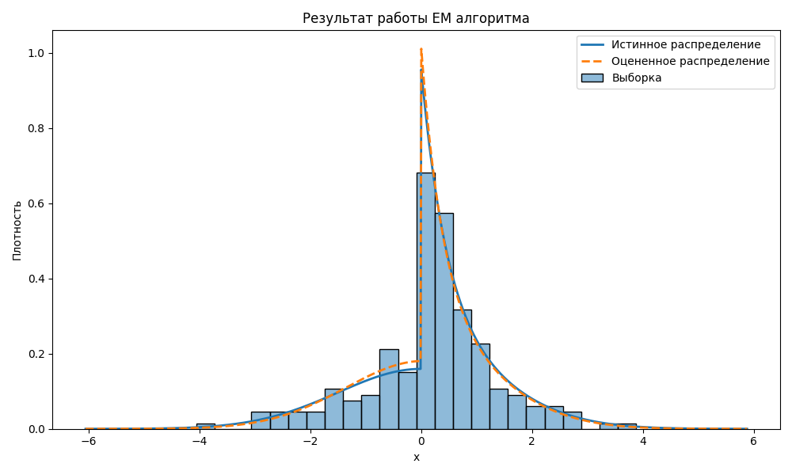

# Содержание

1. **Введение**

   1.1. Назначение библиотеки

   1.2. Цели документации

   1.3. Глоссарий

2. **Архитектурный обзор**

   2.1. Основные принципы

   2.2. Высокоуровневая диаграмма архитектуры

   2.3. Технологический стек

3. **Архитектурные компоненты**

   3.1. Mpest Core

   3.2. Methods

   3.3. EM

   3.4. Вспомогательные

4. **Потоки данных**

   4.1. Поток данных при оценке параметров смеси

5. **Анализ текущей архитектуры**

6. **Примеры использования**

   6.1. Работа с MixtureDistribution

   6.2. Работа с классом EM


# 1. Введение

## 1.1. Назначение библиотеки

Библиотека `pysatl-mpest` предназначена для решения задачи оценки параметров смеси вероятностных распределений. Она предоставляет инструментарий для:

- Работы со смесями распределений как с едиными вероятностными объектами.
- Оценки параметров компонент смеси на основе выборочных данных с использованием различных алгоритмов.
- Конфигурирования и проведения вычислительных экспериментов по исследованию свойств алгоритмов оценки.

**Основные сценарии использования**:

1. Оценка параметров смеси:
   Пользователь предоставляет набор данных (выборку) и начальное предположение о структуре данных (компоненты смеси, начальные приближения параметров, веса). Пользователь выбирает алгоритм и конфигурирует его (выбирает критерий удаления компонент, критерий останова) и система используя алгоритм оценивает оптимальные параметры.

2. Работа со смесью распределений:
   Пользователь может создавать класс смеси и работать с ним как с распределением (сэмплировать, считать плотность в точке и т.д.)
3. Конфигурирование и запуск эксперимента:
   Пользователь может сконфигурировать все этапы эксперимента (генерацию, оценку и анализ), выбрать конкретные алгоритмы после чего запустить эксперимент. На третьем этапе, пользователь может оценить эффективность конкретного алгоритма, или сравнить два алгоритма.


## 1.2. Цели документации

Документ предназначен для описания текущего состояния проекта `pysatl-mpest`.

Целевой аудиторией являются разработчики, которые будут принимать участие в разработке/расширении библиотеки. По большей части данная документация предназначается для тех, кто будет разбираться со структурой проекта на *Летней школе*.

Помимо информации о проекте и его структуре, в данном файле будет предоставлена проблематика текущей архитектуры, ее недостатки и возможные способы их исправить.


## 1.3. Глоссарий

​	**Смесь распределений** $-$ вероятностный объект, включающий в себя $n$ компонент, каждая из которых представляет собой вероятностное распределение с плотностью $f_i$ и параметрами $\theta_i$. Плотность смеси распределений можно задать таким образом:
$$
f(x ~ | ~ F, \Theta, \Omega) = \sum_{k=1}^n \omega_k \cdot f_k(x ~ | ~ \theta_k)
$$
где:

- $F = \{f_1, \dots, f_n\}$ — множество плотностей компонент
- $\Theta = \{\theta_1, \dots, \theta_n\}$ — множество параметров для каждой компоненты
- $\Omega = \{\omega_1, \dots, \omega_n\}$ — множество весов компонент, причем $\sum_{i=1}^n \omega_i = 1$ и $\forall i ~ \omega_i \ge 0$​

Смесь позволяет моделировать более сложные распределения, которые могут  возникать, когда данные происходят из нескольких различных подгрупп.

Пример плотности смеси распределений с двумя Нормальными компонентами:



---


​	**EM алгоритм** $-$ семейство итеративных алгоритмов, которые оценивают параметры смеси распределений. Обычно состоят из двух шагов:

1. **E-шаг**: Поиск наиболее вероятных значений скрытых переменных/
2. **M-шаг**: Вычисление открытых параметров на основе значений полученных на E-шаге.


---


​	**MLE-EM** **алгоритм** $-$ частный случай EM алгоритма, основанный на функции правдоподобия:

1. **E-шаг**: Оцениваем апостериорные вероятности принадлежности каждого наблюдения каждой компоненте смеси.
2. **M-шаг**: Решаем задачу оптимизации по параметрам смеси, на основе вероятностей из E-шага.


---


​	**ELM алгоритм** $-$ частный случай ЕМ алгоритма, основанный на оценке с помощью L-моментов:

1. **E-шаг**: Оцениваем апостериорные вероятности принадлежности каждого наблюдения каждой компоненте смеси.
2. **M-шаг**: Оцениваем параметры на основе вероятностей из E-шага при помощи L-моментов.


# 2. Архитектурный обзор

## 2.1. **Основные принципы**

Основным принципом текущей архитектуры является четкое разделение алгоритмов и функциональности, которая отвечает за смесь распределений. Пользователь создает объект, с которым будет работать алгоритм с помощью класса `Problem` и передает его в заранее сконфигурированный `EM`.  То есть точкой соприкосновения этих двух частей являются классы `Problem` и `EM`.

#### EM

Класс `EM` на данный момент представляет собой некий *"Оркестратор"*, который управляет всем процессом внутри себя. При инициализации он принимает объект класса `Method`, который указывает, какой алгоритм будет запущен.

На данный момент реализуются лишь итеративные алгоритмы на основе EM (Expectation Maximization) состоящие из двух шагов: E-step и M-step. Вариаций шагов может быть много, поэтому было решено поделить их на `AExpectation` и `AMaximization` соответственно, от который будут наследоваться конкретные реализации шагов. Ими управляет класс `Method`.

После каждой итерации необходимо удалять лишние компоненты смеси (например вырождающиеся или с неправильными параметрами). За это отвечают объекты класса `ADistributionChecker`. Объект класса `Breakpointer` отвечает за условие остановки алгоритма (например максимальное число итераций).

#### Смеси распределений

Работа со смесями распределений идет через класс `MixtureDistribution`, который инициализируется с помощью списка объектов `Distribution`. Конкретные реализации распределений наследуются от `AModel`, после чего оборачиваются в класс `Distribution`.

Некоторые реализации EM используют оптимизацию, при которой параметры могут выйти из области определения. Таким образом необходимо нормализовать параметры для того, чтобы они были определены на всем $\mathbb{R}$. Методы объектов `AModel` использует внутренние (internal) параметры, тогда как `Distribution` использует внешние (external) параметры, которые являются общепринятыми.


## 2.2. Высокоуровневая диаграмма архитектуры


## 2.3. Технологический стек

Технологический стек включает в себя:

- `Python`: Как основной язык.
- `scipy`: На эту библиотеку делегировано сэмплирование, а так же написаны адаптеры к их оптимизаторам.
- `numpy`: Для векторизации.
- `matplotlib + seaborn`: Для визуализации данных (В основном используется в экспериментальном окружении).


# 3. Архитектурные компоненты

## 3.1. Mpest Core

Этот компонент является ядром системы и предоставляет основные абстракции и  структуры данных для работы с вероятностными распределениями и задачами их оценки.

- **`AModel (mpest.models.abstract_model.AModel)`**:
  - **Назначение**: Абстрактный базовый класс (интерфейс), определяющий контракт для всех моделей вероятностных распределений. Он требует реализации методов для  вычисления функции плотности вероятности (`pdf`), ее логарифма (`lpdf`), а также методов для конвертации параметров (`params_convert_to_model`, `params_convert_from_model`). Последние необходимы для преобразования внешних (общепринятых) параметров распределения во внутреннее представление, удобное для оптимизаторов (например, для обеспечения положительности параметров через логарифмирование).
  - **Подклассы**: `AModelDifferentiable` (добавляет вычисление производных логарифма PDF по параметрам), `AModelWithGenerator` (добавляет генерацию выборок).
  - **Конкретные реализации**: `Beta`, `Cauchy`, `ExponentialModel`, `GaussianModel`, `Pareto`, `Uniform`, `WeibullModelExp`. Каждая модель реализует специфическую математику для своего распределения.
- **`Distribution (mpest.core.distribution.Distribution)`**:
  - **Назначение**: Представляет одиночное вероятностное распределение. Инкапсулирует конкретную модель (`AModel`) и ее параметры (`Params`). Предоставляет методы для вычисления `pdf` и генерации выборок (если модель поддерживает это).
  - **Особенность**: Вне ЕМ алгоритма содержит внешнее представление параметров, а внутри внутреннее.
- **`DistributionInMixture (mpest.core.mixture_distribution.DistributionInMixture)`**:
  - **Назначение**: Расширяет `Distribution`, добавляя априорную вероятность (`prior_probability`) для данного компонента в контексте смеси распределений.
- **`MixtureDistribution (mpest.core.mixture_distribution.MixtureDistribution)`**:
  - **Назначение**: Представляет смесь вероятностных распределений. Содержит список объектов `DistributionInMixture`. Отвечает за нормализацию априорных вероятностей и может вычислять общую `pdf` смеси, а также генерировать выборки из смеси.
- **`Problem (mpest.core.problem.Problem)`**:
  - **Назначение**: Инкапсулирует постановку задачи оценки параметров: содержит выборку данных (samples) и начальное приближение смеси распределений (`MixtureDistribution`). Передается в EM алгоритм.


## 3.2. EM

Этот компонент реализует сам EM-алгоритм, его управляющую логику, условия  остановки и проверку корректности распределений на каждой итерации.

- **`EM (mpest.em.em.EM)`**:
  - **Назначение**: Основной класс, реализующий EM-алгоритм. Является реализацией `ASolver`. Оркестрирует процесс, выполняя шаги E и M до выполнения условия останова.
  - **Взаимосвязи**:
    - Использует `ABreakpointer` для определения момента остановки.
    - Использует `ADistributionChecker` для проверки и удаления "вырожденных" распределений.
    - Использует `Method` для выполнения конкретных E- и M-шагов.
    - Работает с `Problem` из Mpest Core.
    - Внутренне использует `_DistributionMixtureAlive` для управления активными компонентами смеси в процессе работы.
- **`EM.ABreakpointer (mpest.em.em.EM.ABreakpointer)`**:
  - **Назначение**: Абстрактный класс (интерфейс) для стратегий определения условия останова EM-алгоритма.
  - **Конкретные реализации**:
    - `StepCountBreakpointer`: остановка после заданного числа итераций.
    - `ParamDifferBreakpointer`: остановка, если изменения параметров и априорных вероятностей между итерациями меньше заданного порога.
    - `UnionBreakpointer`: позволяет комбинировать несколько условий останова. Можно это делать с помощью знака +.
- **`EM.ADistributionChecker (mpest.em.em.EM.ADistributionChecker)`**:
  - **Назначение**: Абстрактный класс (интерфейс) для стратегий проверки "жизнеспособности" компонентов смеси на каждой итерации. Позволяет динамически удалять вырожденные распределения.
  - **Конкретные реализации**:
    - `FiniteChecker`: проверяет, что параметры и априорная вероятность конечны (не NaN/inf).
    - `PriorProbabilityThresholdChecker`: проверяет, что априорная вероятность компонента выше заданного порога (после определенного числа шагов).
    - `UnionDistributionChecker`: позволяет комбинировать несколько проверок. Можно это делать с помощью знака +.
- **`EM.DistributionMixtureAlive (mpest.em.EM.DistributionMixtureAlive)`**:
  - **Назначение**: Внутренний вспомогательный класс EM. Представляет смесь распределений в процессе работы EM-алгоритма,  управляя активными (не вырожденными) компонентами и их индексами.


## 3.3. Methods

Этот компонент определяет конкретные реализации E-шага (Expectation) и M-шага (Maximization) EM-алгоритма.

- **`Method (mpest.em.methods.method.Method)`**:

  - **Назначение**: Контейнер для пары конкретных реализаций E-шага (`AExpectation`) и M-шага (`AMaximization`). Представляет собой стратегию выполнения одной полной итерации EM-алгоритма.
  - **Взаимосвязи**: Композиционно включает объекты `AExpectation` и `AMaximization`. Используется классом `EM`.

- **`AExpectation (mpest.em.methods.abstract_steps.AExpectation)`**:

  - **Назначение**: Абстрактный класс (интерфейс) для E-шага.
  - **Конкретные реализации**:
    - `BayesEStep` (для MLE-EM): вычисляет апостериорные вероятности принадлежности каждой точки выборки к каждому компоненту смеси на основе формулы Байеса.
    - `IndicatorEStep` (для ELM): вычисляет "индикаторы" принадлежности на основе текущих PDF и априорных вероятностей.

- **`AMaximization (mpest.em.methods.abstract_steps.AMaximization)`**:

  - **Назначение**: Абстрактный класс (интерфейс) для M-шага.
  - **Конкретные реализации**:
    - `LikelihoodMStep` (для MLE-EM): пересчитывает параметры моделей, максимизируя взвешенную логарифмическую функцию правдоподобия. Может использовать `AOptimizer` или `AOptimizerJacobian` для численной оптимизации.
    - `LMomentsMStep` (для ELM): пересчитывает параметры моделей на основе вычисленных L-моментов для каждого компонента смеси.


## 3.4. Вспомогательные

### Optimizers

Этот компонент предоставляет различные алгоритмы численной оптимизации, которые могут использоваться на M-шаге (в частности, в `LikelihoodMStep`) для нахождения параметров, минимизирующих/максимизирующих целевую функцию.

- **`AOptimizer / AOptimizerJacobian (mpest.optimizers.abstract_optimizer)`**:
  - **Назначение**: Абстрактные базовые классы (интерфейсы) для оптимизаторов. `AOptimizerJacobian` предназначен для методов, использующих якобиан (градиент).
  - **Конкретные реализации**: Обертки над методами из `scipy.optimize`:
    - `ScipyCG` (Conjugate Gradient)
    - `ScipyCOBYLA`
    - `ScipyNelderMead`
    - `ScipySLSQP`
    - `ScipyTNC`
    - `ScipyNewtonCG` (использует якобиан)

### Utils

Этот модуль предоставляет набор утилит, декораторов и классов-оберток,  которые используются в различных частях библиотеки для решения общих  задач, таких как структурирование результатов, логирование, измерение времени выполнения и работа с итераторами.

- **Классы-обертки (Wrappers)**:
  - **`ObjectWrapper[T]`**:
    - **Назначение**: Простой дженерик-класс, оборачивающий некоторый объект (content). Служит базовым классом для других, более специализированных оберток. Позволяет единообразно обращаться к содержимому через свойство content.
  - **`ResultWrapper`[T]**:
    - **Назначение**: Наследуется от `ObjectWrapper`. Предназначен для обертывания результатов выполнения операций. Предоставляет свойство `result`.
  - **`ResultWithError[T]`**:
    - **Назначение**: Наследуется от `ResultWrapper`. Используется для инкапсуляции результата операции, который может либо содержать данные типа `T`, либо ошибку типа `Exception`.
    - **Особенности**:
      - Если при выполнении операции произошла ошибка, она сохраняется в поле _error.
      - Свойство `result` при обращении проверяет наличие ошибки. Если ошибка есть, она выбрасывается. Если нет ни ошибки, ни результата (оба `None`), выбрасывается `ValueError`. Это гарантирует, что потребитель либо получит корректный результат, либо будет уведомлен об ошибке.
      - Используется, например, как тип возвращаемого значения для методов `solve()` и шагов EM-алгоритма.
  - **`ResultWithLog[T, R]`**:
    - **Назначение**: Наследуется от `ResultWrapper`. Добавляет возможность прикрепить к результату (`content` типа `T`) произвольный лог (`log` типа `R`).
    - **Применение**: Используется в `EM.solve_logged()` для возврата не только итоговой смеси распределений, но и объекта `EM.Log`, содержащего историю итераций.
  - **`TimerResultWrapper[T]`**:
    - **Назначение**: Наследуется от `ResultWrapper`. Оборачивает результат операции (`content` типа `T`) и добавляет информацию о времени ее выполнения (runtime).
    - **Применение**: Используется декоратором `@timer` и `@logged` для автоматического измерения времени выполнения функций и сохранения этой информации.
  - **`IteratorWrapper[T, R]`**:
    - **Назначение**: Дженерик-класс для создания пользовательских итераторов. Принимает  экземпляр некоторого объекта и функцию, которая определяет, как получить следующий элемент на основе этого экземпляра и текущего индекса.
    - **Применение**: Используется в `MixtureDistribution` для реализации протокола итерации по содержащимся в ней `DistributionInMixture`.
- **Декораторы**:
  - **`@apply(mapper: Callable[[R], T])`**:
    - **Назначение**: Декоратор, который применяет заданную функцию `mapper` к результату декорируемой функции.
  - **`@timer`**:
    - **Назначение**: Декоратор для измерения времени выполнения функции. Оборачивает результат функции в `TimerResultWrapper`, который содержит сам результат и время выполнения.
  - **`@history(holder: list[T], mapper: Callable[[R], T] = lambda x: x)`**:
    - **Назначение**: Фабрика декораторов. Декорированная функция будет добавлять свой результат (опционально преобразованный функцией `mapper`) в предоставленный список `holder` при каждом вызове.
  - **`@logged(holder: list, save_results: bool, save_results_mapper: Callable, save_time: bool)`**:
    - **Назначение**: Комплексный декоратор, упрощающий одновременное использование `@timer` и `@history`.
    - **Функциональность**:
      - Если `save_time` истинно, измеряет время выполнения.
      - Если `save_results` истинно, сохраняет результат (возможно, преобразованный `save_results_mapper`).
      - Записывает в `holder` либо только время (`float`), либо `ObjectWrapper` с результатом, либо `TimerResultWrapper` с результатом и временем, в зависимости от флагов.
    - **Применение**: Используется в `EM.make_step()` для сбора логов и информации о производительности каждой итерации EM-алгоритма.
  - **`@in_bounds(min_value: float, max_value: float)`**:
    - **Назначение**: Декоратор для функций, возвращающих `float`. Ограничивает результат функции заданным диапазоном [min_value, max_value].
- **Другие утилиты**:
  - **`ANamed`**:
    - **Назначение**: Абстрактный базовый класс, требующий от наследников реализации свойства `name`. Позволяет единообразно получать имя различных объектов (например, моделей, оптимизаторов, стратегий останова/проверки).
  - **`Factory[T]`**:
    - **Назначение**: Простая реализация паттерна Фабрика. Позволяет инкапсулировать логику создания объектов определенного класса с заданными аргументами. Метод `construct()` создает новый экземпляр.
  - **`find_file(name, path)`**:
    - **Назначение**: Утилита для поиска файла по имени в указанной директории и ее поддиректориях.


# 4. Потоки данных

Этот раздел описывает основные потоки данных в библиотеке pysatl-mpest, иллюстрируя, как информация передается и обрабатывается между ключевыми компонентами во время выполнения типичных задач, таких как оценка  параметров смеси.

На самом деле сейчас такой поток единственный.

### 4.1. Поток данных при оценке параметров смеси

Это основной поток данных в системе. Его можно разбить на несколько этапов:

**1. Инициализация и подготовка:**

- **Входные данные:**
  - `samples: np.ndarray` – массив выборочных данных.
  - `initial_mixture_distribution: MixtureDistribution` – начальное предположение о смеси, включающее:
    - Список `DistributionInMixture`, каждый из которых содержит:
      - `AModel` (конкретная модель распределения, например, `GaussianModel`).
      - `initial_params: np.ndarray` – начальные параметры для этой модели (внешние).
      - `initial_prior_probability: float` – начальная априорная вероятность компонента.
- **Процесс:**
  1. Пользователь создает объект `Problem`, инкапсулируя `samples` и `initial_mixture_distribution`.
  2. Пользователь создает объект `EM`, передавая ему:
     - `Method` (например, `LikelihoodMethod`, состоящий из `BayesEStep` и `LikelihoodMStep`).
     - `ABreakpointer` (например, `StepCountBreakpointer + ParamDifferBreakpointer`).
     - `ADistributionChecker` (например, `FiniteChecker + PriorProbabilityThresholdChecker`).
  3. Вызывается метод `EM.solve()`.
  4. **(Если normalize=True)** В `EM.solve_logged()`:
     - `preprocess_problem()`: Параметры каждого `DistributionInMixture` в `problem.distributions` конвертируются из внешнего представления во внутреннее с помощью `model.params_convert_to_model()`. Создается новый `Problem` с этими внутренними параметрами.
  5. Создается внутренний объект `EM._DistributionMixtureAlive` из `problem.distributions`. Этот объект будет отслеживать "живые" компоненты смеси.

**2. Итерационный процесс EM-алгоритма (цикл while в `EM.solve_logged()`):**

На каждой итерации step:

- **Сохранение предыдущего состояния:** previous_step (копия distributions.all_distributions) сохраняется для ABreakpointer.

- **Вызов `make_step(step, distributions)`:**

  1. Создается новый `Problem` с текущими `distributions`

  2. **E-шаг:** `EM.step(new_problem, self.method)` вызывает `self.method.step(new_problem)`, что, в свою очередь, вызывает `self.method.e_step.step(new_problem)`:

     Реализуется E-шаг алгоритма, после чего результат передается в M-шаг алгоритма.

  3. **M-шаг:** вызывается `method.m_step.step(e_result)`:

     Реализуется M-шаг алгоритма, возвращая результирующую смесь.

  4. **Обновление состояния смеси:**

     - `distributions.update(result.content, distribution_checker_lambda)`:
       - Для каждого компонента `d` в обновленной смеси вызывается `self.distribution_checker.is_alive(step, d)`:
       - Если компонент "не жив", его `prior_probability` устанавливается в `None`.
       - Активные компоненты и их индексы обновляются, происходит нормализация весов.

  5. **Логгирование (если create_history=True):**

     - Результат шага (с ошибкой, если есть) преобразуется `log_map` (получая `all_distributions` из `_DistributionMixtureAlive`) и добавляется в `history` (возможно, с временем выполнения, если `remember_time=True`).

- **Проверка условия останова:** `self.breakpointer.is_over(step, previous_step, distributions.all_distributions)`:

**3. Завершение и постобработка:**

- **(Если normalize=True)** `В EM.solve_logged()`:
  - Итоговая `MixtureDistribution` передается в `postprocess_result()`.
  - Параметры каждого `DistributionInMixture` конвертируются из внутреннего представления обратно во внешнее с помощью `model.params_convert_from_model()`.
- **Формирование результата:**
  - Создается `ResultWithError` с финальной `MixtureDistribution` (с внешними параметрами, если была нормализация).
  - Если `solve_logged` вызывался, создается `EM.Log` из `history`.
  - Возвращается `ResultWithLog` (содержащий `ResultWithError` и `EM.Log`) или просто `ResultWithError`.





# 5. Анализ текущей архитектуры

### Ядро (Mpest core)

1. Класс `Distribution` хоть и является оберткой для `AModel`, но не реализует всех его методов (например `lpdf`). Таким образом, для вызова нереализованных методов необходимо вызывать `model`, что плохо.

2. Для некоторых алгоритмов (не для всех) необходимо преобразовывать параметры так, чтобы они были на всем $\mathbb{R}$. Из-за этого появляется разделение на внутренние (*internal_params*) и внешние (*external_params*) параметры. Сейчас в коде, преобразование во внутренние параметры происходит перед началом алгоритма (для всех алгосов, даже для тех, для которых это не является необходимым), а в конце происходит переход к внешним параметрам (общепринятым).

   При этом объекты `AModel` используют внутренние параметры, что расходится с классом `Distribution`.


3. Не у всех распределений необходимо конвертировать параметры (примером является равномерное распределение)

4. Из-за того, что `Distribution` является обёрткой для `AModel`, нельзя при инициализации адекватно проверить правильность введенных параметров (Например в равномерном распределении $a < b$​)

5. У моделей распределений происходит подсчёт L-моментов через миксины, что является лишним.

### Алгоритмы

1. Существует множество вариаций EM алгоритма (EM, ELM, ELQM, ETLM, etc.) в каждой из которых можно изменить E и M шаги (например в E шаге вместо Байесовского подхода к оценке матрицы $Z$, использовать классификатор).

   Сейчас реализован общий `EM`, который принимает E и M шаги. Внутри него же происходит конвертация параметров.

2. Выбранные E и M шаги работают для всех компонент смеси. В этом и проблема. Если мы используем ELM алгоритм на смеси нормального распределения и распределения Коши, то получим ошибку, т.к. этот метод не применим к Коши. Соответственно необходимо уметь для каждой компоненты выбирать метод которым будем оценивать.

### Общие соображения

В пакете реализовано много ненужных классов, как абстрактных так и в модуле `utils.py`. Например, непонятно зачем нужен `APDFAble` или `IteratorWrapper`.


# 6. Примеры использования

## 6.1. Работа с MixtureDistribution

```Python
import numpy as np
import matplotlib.pyplot as plt
from mpest import Distribution, MixtureDistribution
from mpest.models import GaussianModel, ExponentialModel

# Создание смеси распределений
mixture1 = MixtureDistribution.from_distributions(
    distributions=[
        Distribution.from_params(GaussianModel, [0.0, 1.0]),
        Distribution.from_params(GaussianModel, [5.0, 2.0]),
        Distribution.from_params(ExponentialModel, [0.5]),
    ],
    prior_probabilities=[0.3, 0.5, 0.2]
)

# Генерация случайной выборки из смеси
n_samples = 1000
samples = mixture1.generate(n_samples)
```




## 6.2. Работа с классом EM

```Python
from mpest import Distribution, MixtureDistribution, Problem
from mpest.em import EM
from mpest.em.breakpointers import StepCountBreakpointer
from mpest.em.distribution_checkers import FiniteChecker
from mpest.em.methods.likelihood_method import BayesEStep, LikelihoodMStep
from mpest.em.methods.method import Method
from mpest.models import GaussianModel, ExponentialModel
from mpest.optimizers.scipy_cobyla import ScipyCOBYLA

# 1. Создаем истинное распределение (смесь гауссовского и экспоненциального)
true_mixture = MixtureDistribution.from_distributions(
    [
        Distribution.from_params(GaussianModel, [0.0, 1.5]),
        Distribution.from_params(ExponentialModel, [2.0]),
    ],
    [0.6, 0.4],
)

# 2. Генерируем выборку
n_samples = 200
samples = true_mixture.generate(n_samples)

# 3. Создаем начальное приближение
initial_mixture = MixtureDistribution.from_distributions(
    [
        Distribution.from_params(GaussianModel, [-2.0, 3.0]),
        Distribution.from_params(ExponentialModel, [1.0]),
    ],
    [0.5, 0.5],
)

# 4. Формулируем проблему
problem = Problem(samples, initial_mixture)

# 5. Настройка EM алгоритма
e_step = BayesEStep()
m_step = LikelihoodMStep(ScipyCOBYLA())
method = Method(e_step, m_step)

breakpointer = StepCountBreakpointer(max_step=50)
checker = FiniteChecker()

# 6. Запуск EM алгоритма
em = EM(breakpointer, checker, method)
result = em.solve(problem)
```


